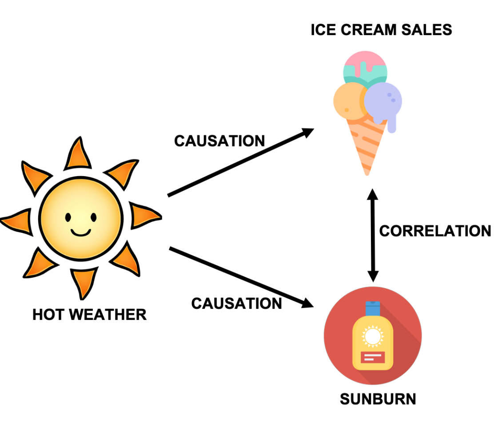

# Introduction
준실험법(quasi-experiment)은 실험 연구의 한 유형으로, 완전한 무작위 배정(random assignment)이 이루어지지 않은 경우에 사용되는 방법입니다. 준실험법은 통제된 실험(controlled experiments)과 자연 관찰(naturalistic observations)의 중간 형태로 볼 수 있습니다. 이 방법은 특히 연구자가 실험적 조건을 완전히 통제할 수 없거나, 윤리적, 실제적 제약으로 인해 무작위 배정을 실시할 수 없는 상황에서 유용합니다. 준실험법은 교육, 사회학, 심리학 등 다양한 분야에서 널리 사용되며, 특히 정책 개발, 프로그램 평가, 혁신적인 교육 기법의 효과성 평가 등에 유용하게 활용됩니다. 이러한 연구 방법은 현장에서 직접적으로 관찰하고 개입할 수 있는 가능성을 제공하므로, 이론과 실제의 괴리를 좁히는 데 크게 기여할 수 있습니다.

준실험 설계의 주요 특징은 다음과 같습니다:

1. **무작위 배정의 부재**: 연구 참가자를 실험과 대조 그룹에 무작위로 배정하지 않습니다. 대신, 연구자는 기존의 그룹을 사용하거나 다른 기준에 따라 참가자를 그룹화합니다.

2. **조작적 변수(Manipulative Variable)**: 연구자는 일부 변수를 조작하여 그 효과를 관찰할 수 있습니다. 이는 통제된 실험과 유사하지만, 모든 외부 변수를 통제할 수는 없습니다.

3. **사전 측정 및 사후 측정(Pretest and Posttest)**: 연구자는 실험 시작 전과 후에 참가자들의 반응이나 행동을 측정할 수 있습니다. 이를 통해 변수 조작의 효과를 평가할 수 있습니다.

4. **비교 그룹**: 때로는 실험 그룹과 비교할 수 있는 대조 그룹이 설정되기도 합니다. 하지만 이 대조 그룹은 무작위로 구성된 것이 아니라 선택된 그룹일 수 있습니다.

## Model

다음 모델을 생각해봅시다.

- $T_{i}$ : 어떤 관측 결과(i라는 이름)이 처리(treatment)효과를 받았는지의 여부(즉, 0=처리없음, 1=처리함)를 표시함.
- $A_{i}$ : 시간적으로 과거의 시점인지(A=0), 현재의 시점인지(A=1)인지를 표시함.

수학에서 각각의 일이 개별적으로 발생한다면 더하기(+)로, 함께 발생한다면 곱하기($\times$)로 표시하기 때문에 우리는 처리를 받았다는 사실과 시간이 흘렀다는 사실은 이들이 개별적인 존재이자(더하기), 동시적 사건(곱하기)으로 표현되어 분석될 수 있습니다. 즉, 처리를 받거나 안받거나와 시간이 흐르거나 흐르지 않았다는 것은 별개일 수도 있고, 이들이 어떤 연관성이 있을 수도 있다는 것입니다.

예를 들어, 광고를 보고 물건을 구매했는가를 알아보기 위해 준실험법을 적용한다고 합시다. 이때 우리가 보고 싶은 효과는 물건을 구매한 여부(구매하지 않음=0, 구매함=1)입니다. 이를 새로운 변수 $Y_{i}$로 둡니다. 어떠한 이유도 없이 어떤 사람(i)는 물건을 구매하거나 구매하지 않을 수도 있습니다. 이처럼 개인이 가지고 있는 고유한 특성치는 상수(constant value)로 주어집니다. 이를 $\beta_0$라고 하겠습니다. 이제 모델을 수학적으로 표현하면 다음과 같습니다.

$$
Y_{i} = \beta_0 + \beta_1 T_i + \beta_2 A_i + \color{red} \beta_3 T_i \times A_i + \varepsilon_i
$$
위에서 베타 1부터 3까지는 우리가 계산할 효과들을 나타냅니다. 또한 바입실론(Var Epsilon)은 미처 우리가 알지 못하는 광고 구매 이유에 관한 설명을 나타냅니다.

:)      | After = 0              | After = 1
--------|------------------------|---------------------
Treat=0 | $$\beta_0$$            | $$\beta_{0} + \beta_{2}$$ 
Treat=1 | $$\beta_{0} + \beta_{1}$$| $$\beta_{0} + \beta_{1} + \beta_{2}+\beta_{3}$$

광고를 본 그룹(Treat=1)의 시간 흐름은 After=1에서 After=0의 경우를 빼면 됩니다. 위 표에서는 $\beta_0+\beta_1+\beta_2+\beta_3$에서 $\beta_0+\beta_1$을 뺀 것이니까 남은 것은 $\beta_2+\beta_3$입니다. 

이제 광고를 보지 않은 그룹(Treat=0)에서 시간 효과는 마찬가지로 $\beta_0+\beta_2$에서 $\beta_0$을 뺀 것으로 이해되니까 결과는 $\beta_2$가 됩니다. 

이제 시간효과를 계산해 두었으니 처리 효과만을 고려할 수 있습니다. 위에서 Treat=1의 그룹과 Treat=2의 그룹을 빼면 되니까 $\beta_2+\beta_3$에서 $\beta_2$를 빼면 되겠네요. 그려면 결과는 $\beta_3$이 나오는데 이것이 바로 준실험의 효과를 나타내는 파라미터($\beta$)입니다.

## Confounding Factor의 문제

준실험 연구에서 **혼입 변수(confounding factor)** 또는 혼란 변수 문제는 매우 중요한 이슈입니다. 혼입 변수는 연구에서 측정하고자 하는 변수와 결과 간의 관계를 왜곡시키는 미통제 변수입니다. 이러한 변수들은 실험 결과에 영향을 주어, 실제 원인 변수와 결과 사이의 관계를 정확히 이해하는 데 방해가 될 수 있습니다.

혼입 변수는 결과에 영향을 줄 수 있는 다른 변수들과 연구 대상 변수가 혼합되어 있을 때 발생합니다. 예를 들어, 어떤 건강 프로그램의 효과를 연구할 때, 참가자의 연령, 성별, 생활 습관 등 다양한 요인이 건강 상태에 동시에 영향을 줄 수 있습니다. 이러한 변수들이 적절히 통제되지 않으면, 프로그램의 효과를 오해할 위험이 있습니다.

혼입 변수를 관리하는 방법은 다음과 같습니다:

1. **계층화(Stratification)**: 연구 참여자를 혼입 변수에 따라 여러 그룹으로 나누고, 각 그룹 내에서 결과를 비교합니다. 이 방법은 그룹 간 차이를 최소화하여 더 정확한 비교를 가능하게 합니다. 계층화는 연구 참가자를 혼입 변수(예: 연령, 성별, 사회경제적 지위 등)를 기준으로 여러 소그룹(계층)으로 나누는 과정입니다. 이렇게 구분된 각 계층 내에서, 연구의 처리 효과를 독립적으로 평가하고, 이들 평가 결과를 종합하여 전체 효과를 추정합니다. 그러나 여러 소그룹으로 나누어 진행하기 때문에, 데이터 수집과 분석 과정이 복잡하고 시간이 많이 소요될 수 있습니다. 또한 각 계층에서 충분한 표본 크기를 확보하는 것이 어려울 수 있으며, 특히 소규모 계층에서는 통계적 검정력이 떨어질 수 있습니다.

2. **공변량 분석(Covariate Analysis)**: 통계적 방법을 사용하여 주요 연구 변수의 영향을 분석하면서 혼입 변수의 영향을 조절합니다. 예를 들어, 분산분석(ANOVA)이나 공분산분석(ANCOVA) 등이 있습니다. 공변량 분석(Covariate Analysis)은 연구 결과에 영향을 미칠 수 있는 혼입 변수들을 통계적으로 조절하는 방법 중 하나입니다. 이 방법은 주로 분산분석(ANOVA)과 함께 사용되며, 공분산분석(ANCOVA)의 형태로 나타납니다. 공변량 분석의 주요 목적은 주요 효과(예: 실험 처리의 효과)를 더 정확하게 추정하기 위해 혼입 변수의 영향을 조절하는 것입니다. 먼저 연구 설계 단계에서, 결과 변수에 영향을 미칠 가능성이 있는 모든 변수들을 식별합니다. 이 변수들은 선행 연구, 이론적 근거, 또는 예비 데이터 분석을 통해 선정될 수 있습니다. 데이터를 수집한 이후 ANCOVA 모델을 설정할 때, 결과 변수를 종속 변수로, 주요 처리 효과(실험 조건)를 독립 변수로, 그리고 혼입 변수들을 공변량으로 포함시킵니다. 다음으로 모델을 사용하여 데이터를 분석합니다. 이 때, 공변량의 효과를 조절한 후 주요 처리 효과가 통계적으로 유의한지를 검정합니다. 이 분석은 공변량 분석은 일반적으로 변수 간의 선형 관계를 가정합니다. 이 가정이 유효하지 않은 경우, 분석 결과가 왜곡될 수 있습니다. 또한 혼입 변수가 주요 독립 변수와 고도로 상관관계를 가지고 있으면, 이 두 변수의 효과를 명확히 분리하기 어려울 수 있습니다.

3. **매칭(Matching)**: 실험 그룹과 대조 그룹을 구성할 때, 혼입 변수를 기준으로 유사한 특성을 가진 참가자들을 서로 짝지어 매칭시킵니다. 이렇게 하면 각 그룹 간의 차이를 최소화하고 혼입 변수의 영향을 줄일 수 있습니다. `매칭(Matching)`은 연구 설계에서 사용되는 방법으로, 특히 준실험과 관찰 연구에서 혼입 변수의 영향을 줄이기 위해 활용됩니다. 매칭을 통해, 연구자는 실험 그룹과 대조 그룹의 참가자들을 비슷한 특성을 가지도록 짝지어, 두 그룹 간의 기초 조건을 동일하게 맞추려고 합니다. 이 방법은 혼입 변수의 영향을 줄임으로써 결과의 신뢰성을 높이고, 인과 관계를 더 명확히 추론할 수 있도록 돕습니다. `경향 점수 매칭(Propensity Score Matching, PSM)`은 관찰 연구에서 혼입 변수의 영향을 조절하기 위한 통계적 방법 중 하나입니다. 이 방법은 참가자들이 특정 처리를 받을 경향성을 예측하는 점수, 즉 경향 점수를 계산하고, 이 점수를 기반으로 실험 그룹과 대조 그룹의 참가자들을 매칭시킵니다. 경향 점수는 참가자의 배경 변수(예: 나이, 성별, 교육 수준 등)를 사용하여 계산됩니다.

혼입 변수는 준실험 설계뿐만 아니라 다른 연구 설계에서도 주요한 문제로 작용할 수 있습니다. 이러한 변수들을 정확히 식별하고 통제하는 것은 연구의 타당성을 높이는 데 필수적입니다. 연구 설계 단계에서부터 혼입 변수를 고려하고, 적절한 통계적 방법을 선택하는 것이 중요합니다.

### Confounding Factor에 관한 예

권혁구 교수님의 강의에 있는 예를 가져와 설명을 해보겠습니다.



아이스크림 판매와 선크림 판매량 사이에 +의 상관관계가 있다고 합시다. 그리고 아이스크림 판매가 먼저 이루어진다고 하면 우리가 보기에는 아이스크림 판매와 선크림 판매 사이에는 인과성이 있는 것처럼 보입니다. 그러나 실제로는 이 둘 모두가 단지 날이 뜨거워서 그럴 수도 있습니다. 그리고 날이 뜨겁다는 것이 사실은 아이스크림 판매와 선크림 판매를 모두 설명하는 원인이 됩니다. 이러한 이유로 날이 뜨거움이라는 사실은 혼입 변수의 역할을 합니다. 따라서 이 경우 혼입변수의 영향을 제한하려면 날이 뜨거운 경우와 그렇지 않은 경우를 모두 포함하여 분석을 해야 합니다. 만약 날이 뜨겁지 않은데도 여전히 아이스크림 판매 이후 선크림 판매가 증가한다면 인과관계를 생각해볼 수도 있습니다.

### PSM

`경향 점수 매칭(Propensity Score Matching, PSM)`은 관찰 연구에서 혼입 변수의 영향을 조절하기 위한 통계적 방법 중 하나입니다. 이 방법은 참가자들이 특정 처리를 받을 경향성을 예측하는 점수, 즉 경향 점수를 계산하고, 이 점수를 기반으로 실험 그룹과 대조 그룹의 참가자들을 매칭시킵니다. 경향 점수는 참가자의 배경 변수(예: 나이, 성별, 교육 수준 등)를 사용하여 계산됩니다.

먼저 MatchIt 패키지가 없다면 설치합니다.

```{r eval=FALSE}
install.packages("MatchIt")
```

예를 위해 데이터를 불러옵니다. 우리는 MatchIt 페키지에 포함된 lalonde 데이터를 사용하기로 합니다.

```{r}
library(MatchIt)
data(lalonde)
```


이 데이터는 미국 국가 지원 작업 시연(National Supported Work Demonstration, NSW)의 치료 그룹에서 추출한 하위 샘플과 소득 역학 인구 조사(Population Survey of Income Dynamics, PSID)의 비교 샘플로 구성되어 있습니다. 이 데이터는 Lalonde(1986)에 의해 처음으로, 그리고 Dehejia와 Wahba(1999)에 의해 재분석 되었습니다.

이 데이터 세트는 614명의 관찰 결과로 구성된 데이터 프레임입니다. 이 중 185명은 처리 그룹이고, 429명은 대조 그룹에 속합니다. 각 개인에 대해 측정된 변수는 총 9가지입니다.

1. "treat": 처리 배정을 나타내며, 1은 처리받은 그룹, 0은 대조 그룹을 의미합니다.
2. "age": 개인의 나이(연수).
3. "educ": 교육 수준을 나타내는 학교 교육 연수.
4. "race": 개인의 인종/민족성(흑인, 히스패닉, 백인). 이전 버전에서는 'black'과 'hispan'이라는 지표 변수를 사용했지만, 이 데이터 세트에서는 하나의 'race' 변수를 사용합니다.
5. "married": 결혼 상태를 나타내며, 1은 기혼, 0은 미혼입니다.
6. "nodegree": 고등학교 학위 보유 여부를 나타내며, 1은 학위 미보유, 0은 학위 보유입니다.
7. "re74": 1974년 소득(미국 달러).
8. "re75": 1975년 소득(미국 달러).
9. "re78": 1978년 소득(미국 달러).

여기서 "treat" 변수는 처리 변수(treatment)로 사용되고, "re78"은 결과 변수로, 나머지는 처리 전 공변량으로 사용됩니다.

이 연구 데이터는 훈련 프로그램의 비실험적 평가 재평가에 중요한 기여를 하며, 실증적 데이터를 이용한 경제학 평가를 평가하는데 중점을 두었습니다. Lalonde(1986)와 Dehejia 및 Wahba(1999)의 작업은 훈련 프로그램의 효과를 분석하는 데 중요한 역할을 했습니다.

#### PSM 수행의 예

로지스틱 회귀 모형을 이용해 PSM을 수행하기로 합니다.

```{r}
ps_model <- matchit(treat ~ age + educ + race + married + nodegree + re74 + re75,
                    data = lalonde, method = "nearest")

```

결과를 확인합시다.

```{r}
summary(ps_model)
```

매칭 이전의 데이터를 보겠습니다(`Summary of Balance for All Data`).

- **Means Treated/Control**: 처리 그룹과 대조 그룹의 평균 값입니다.
- **Std. Mean Diff. (표준 평균 차이)**: 처리 그룹과 대조 그룹 간의 평균 차이를 표준화한 값입니다. 절대값이 0에 가까울수록 두 그룹 간의 평균이 유사함을 의미하며, 일반적으로 0.1(10%) 이하면 두 그룹 간에 잘 매칭되었다고 볼 수 있습니다.
- **Var. Ratio (분산 비율)**: 처리 그룹과 대조 그룹의 분산 비율입니다. 1에 가까울수록 두 그룹의 분산이 유사함을 의미합니다.
- **eCDF Mean**: 경향 점수 분포의 평균 누적 분포 함수 차이입니다. 0에 가까울수록 두 그룹의 경향 점수 분포가 유사함을 의미합니다.
- **eCDF Max**: 경향 점수 분포의 최대 누적 분포 함수 차이입니다. 이 값도 마찬가지로 0에 가까울수록 좋습니다.

결과를 보면 매칭 전 데이터에서 몇몇 변수들은 표준 평균 차이가 높아, 처리 그룹과 대조 그룹 간에 상당한 차이가 있는 것으로 보입니다. 예를 들어, `raceblack` 변수의 경우, 표준 평균 차이가 1.7615로, 두 그룹 간에 큰 차이가 있음을 나타냅니다. 반면에 `educ` 변수의 경우 표준 평균 차이가 0.0550으로, 두 그룹 간에 큰 차이가 없는 것으로 보입니다. 또한 `distance`라는 변수의 표준 평균 차이가 1.7941로 상당히 높으며, 이는 두 그룹 간에 경향 점수 분포의 차이가 크다는 것을 의미합니다. `Var. Ratio`의 값이 모든 변수에서 1에 가깝지 않다는 점은 분산이 그룹 간에 유사하지 않다는 것을 나타냅니다. 

이러한 결과는 매칭 프로세스 후에 분석을 수행하기 전에 불균형을 다루기 위한 추가적인 조치가 필요할 수 있음을 시사합니다. 예를 들어, 가중치를 적용하거나 더 정교한 매칭 알고리즘을 사용할 수 있습니다. 연구자는 이러한 불균형을 해결한 후, 처리 효과의 분석을 진행해야 합니다.


이제 매칭 이후의 결과를 봅시다(`Summary of Balance for Matched Data`). 

결과값이 크게 개선된 것을 볼 수 있습니다. 문제가 되었던 `raceblack`과 `distance`를 살펴보십시오. 그러나 여전히 값은 높습니다. distance의 표준 평균 차이가 매칭 후 0.9739로 여전히 높습니다. raceblack의 경우, 표준 평균 차이가 1.0259로 매우 높은 편입니다. 이는 매칭이 이 변수에 대해 충분히 균형을 이루지 못했음을 의미합니다. 전반적으로, 매칭 후 두 그룹 간의 균형이 개선되었으나 일부 변수(특히 raceblack과 distance)에서 여전히 불균형이 존재합니다. 연구자는 이러한 불균형을 고려하여 결과를 해석해야 하며, 필요한 경우 추가적인 조정을 고려해야 할 수 있습니다. 

매칭된 데이터를 가져오겠습니다.

```{r}
matched_data <- match.data(ps_model)
```

원래 있던 데이터는 614개의 관측치와 9개의 변수로 구성됩니다.
```{r}
dim(lalonde)
str(lalonde)
```
매칭된 데이터의 경우 `distance`, `weight` 그리고 `subclass`가 추가되었습니다.

```{r}
str(matched_data)
```

매칭 후의 데이터를 사용하여 추가 분석을 수행할 수 있습니다. 예를 들어, 매칭된 그룹 간의 수입 차이(re78)를 t-test로 비교해봅시다.

```{r}
t.test(re78 ~ treat, data=matched_data)
```

매치 이전과 비교해보겠습니다.

```{r}
t.test(re78 ~ treat, data = lalonde)
```

결과를 보면 매치 전에는 treat=1인 그룹의 re78 점수가 더 낮았지만(6349.144 < 6984.170), 매치를 한 이후에는 treat=1인 경우 re78 점수가 더 높습니다(6349.144 > 5454.776). 그러나 PSM 결과가 만족스럽지 않기 때문에 이 결론을 믿기도 어렵고, t.test()의 결과도 p-value가 0.3491로 유의수준 0.5에서 유의미하다고 보기 어렵습니다. 매칭 결과를 개선하기 위해 replace=TRUE 옵션으로 두고 샘플링을 중복하는 경우를 허용하겠습니다.

```{r}
ps_model.rep <- matchit(
  treat ~ age + educ + race + married + nodegree + re74 + re75,
  data = lalonde, 
  method = "nearest",
  replace = TRUE)
```

```{r}
summary(ps_model.rep)
```

```{r}
matched_data.rep <- match.data(ps_model.rep)
```

```{r}
t.test(re78 ~ treat, data = matched_data.rep)
```

결과를 보면 이제 treat=1인 경우에 re78이 더 높아졌고 평균의 차이도 더 뚜렷합니다. 또한 p-value가 0.06으로 이전에 비해 크게 개선되었습니다.

### PSM - 음주와 암

```{r}

```

