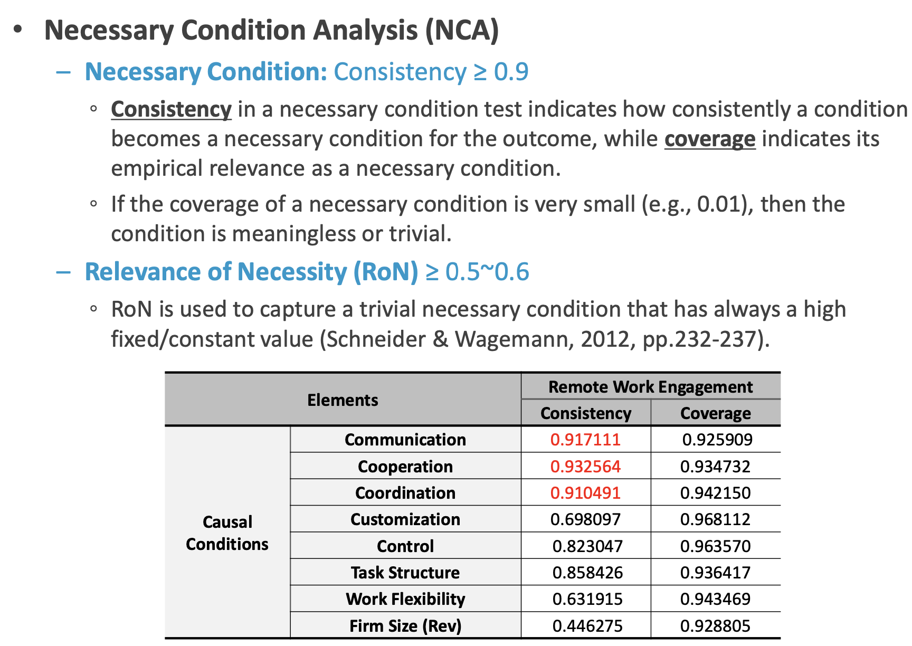

# What is fsQCA {.tabset}

Qualitative Comparative Analysis, 줄여서 QCA는 사회 과학에서 널리 사용되는 연구 방법 중 하나입니다. 이 방법은 다양한 사례들(case studies)을 비교하고 분석하여 공통적인 패턴이나 인과 관계를 찾는 데 주로 사용됩니다. 사례들 간의 비교를 통해 복잡한 현상이나 시스템에서 중요한 요인들을 도출해낼 수 있으며, 특히 한정된 수의 사례들로부터 광범위한 결론을 도출하는 데 유용합니다. QCA는 이진(binary) 또는 다중값(multi-value) 데이터를 사용해 사례들 사이의 관계를 분석하고, 네세서리(necessary) 혹은 서피션트(sufficient) 조건들을 식별하는 데 사용됩니다.

## Basic Theory

### Things You Should Know

이 파트는 https://www.sciencedirect.com/science/article/pii/S0268401221000037 을 참고 하였습니다. 원문을 잘 읽어보시기를 바랍니다.

질적 비교 분석(QCA)은 질적 방법의 논리와 맥락 정보를 활용하면서 많은 사례를 다루는 양적 방법을 결합합니다. 이는 종래의 양적 분석 방법과는 다른 접근 방식입니다. QCA는 다양한 조건 조합을 설명하는 간소화된 문장을 찾아내는 능력이 있습니다. 이러한 조건 조합을 구성이라고 합니다. QCA에는 명확 집합 QCA, 다중 값 QCA, 퍼지 집합 QCA 등 세 가지 주요 유형이 있습니다.

구성 접근 방식에서는 정보시스템 및 마케팅 연구에서 사용자의 행동이나 경험과 같은 결과를 나타내는 조건들을 따로 분리하여 살펴보는 대신, 서로 연관된 구조의 조합으로 간주합니다. 이를 통해 대체로 다양한 구성을 분석함으로써 정보시스템과 마케팅 환경을 체계적이고 전체적으로 이해할 수 있습니다. QCA는 귀납적, 추론적, 그리고 흡추적 추론에 모두 유용하며, 이를 통해 이론을 구축하고 세분화하거나 검증하는 데에도 큰 도움이 됩니다. 또한, 다양한 분야에서 QCA와 그 변형들의 인기가 증가하고 있습니다. 연구의 좋은 실천 표준이 발표되어 연구 방법에 대한 자세한 내용을 담은 교과서들이 출판되었습니다.

QCA 연구는 질적 및 양적 접근법에서 기법을 결합하여, 이러한 연구는 본질적으로 혼합 기법의 응용 프로그램이 됩니다. 이는 두 세계에서 가장 좋은 특성을 결합하는 것입니다. Ragin (2000)에 따르면, 데이터가 "변수별"이 아니라 "사례별"로 분석되는 질적 유도 추론이 양적 실험적 검증과 결합되어, 충분하고 필요한 조건이 통계적 방법을 통해 결과를 식별합니다. 대부분의 경우, QCA는 연구자가 질적 분석의 특성을 가진 양적 분석을 통해 데이터를 깊게 이해할 수 있도록 도와줍니다.

CsQCA (Crisp-set Qualitative Comparative Analysis)는 1987년 Ragin에 의해 처음 개발된 QCA(Qualitative Comparative Analysis)의 변형입니다. 이 도구는 복잡한 이진 데이터 집합을 처리하기 위해 만들어졌습니다. QCA의 목적은 실제 생활의 복잡한 현상에서 인과관계를 설명하는 것으로, 여러 결합 인과관계를 중심으로 합니다. 이는 비선형적이고 비가산적, 비확률적 개념을 사용하며 영구적 인과성을 거부하고, 다양한 조건의 복합적 조합과 결과에 이르는 다양한 경로(등최종성)를 강조합니다. QCA는 불 대수(Boolean algebra)와 불 최소화 알고리즘을 사용하여 복잡한 데이터 구조를 논리적이고 전체적인 방식으로 단순화하고, 여러 결합 인과관계의 패턴을 포착합니다. 불 대수를 사용한다는 것은 QCA가 입력으로 이진 데이터(0 또는 1)를 받고, 변수를 유의미하게 이분화하는 것이 중요하다는 것을 의미합니다. 이를 통해 복잡한 데이터를 간단하고 명확한 논리적 연산으로 처리할 수 있습니다.

mvQCA(Multi-Value Qualitative Comparative Analysis)는 QCA의 확장으로, 변수를 이분법적이 아닌 다값으로 처리합니다. 이 방법은 데이터 세트와 동일한 결과 변수 값을 가진 사례들을 종합하는 개념을 유지합니다. 결과가 동일한 사례들은 여러 변수의 조합을 포함하는 해결책을 통해 설명되며, 이 조합은 해당 결과를 가진 여러 사례를 설명합니다. 이 방법이 소개된 이후, mvQCA의 잠재력과 csQCA 및 fsQCA(자유값 QCA)와의 유용성에 대한 논의가 활발하게 이루어졌습니다. 그러나 이 방법의 집합이론적 지위는 여전히 명확하지 않습니다. mvQCA는 csQCA와 fsQCA에 비해 상대적으로 활용도가 낮은 편입니다. 이는 연구자들 사이에서 이 방법의 효용성과 실제 적용에 대한 고려가 필요함을 시사합니다.

자 이제 fsQCA를 소개합니다. FsQCA(퍼지셋 QCA)는 csQCA의 주요 한계인 이진 변수 사용을 개선합니다. 이진 변수는 자연스럽게 수준이나 정도에 따라 다양한 사례의 복잡성을 완전히 포착하지 못하는 분석의 제한을 초래합니다. 이러한 제한은 정보시스템(IS) 및 마케팅 연구를 포함한 다양한 분야에서 QCA의 널리 사용되지 않는 중요한 이유 중 하나일 수 있습니다. FsQCA는 csQCA를 확장하여 퍼지셋과 퍼지 논리 원칙을 QCA 원칙과 통합합니다. 이는 변수가 0에서 1 사이의 모든 값을 취할 수 있기 때문에 더 현실적인 접근 방식을 제공합니다. 퍼지 집합은 각 조건과 결과에 대한 소속도(membership score)를 할당합니다. 소속도는 0에서 1 사이의 값이며, 0은 해당 조건이나 결과에 완전히 속하지 않음을 의미하고, 1은 완전히 속함을 의미합니다.

예를 들어, "키가 큰 사람"이라는 퍼지 집합(fuzzy set)을 생각해 보겠습니다. 키가 크다는 기준은 명확하지 않고, 사람마다 다르게 판단할 수 있습니다. 퍼지 집합에서는 이러한 불확실성을 수치적으로 표현할 수 있습니다. 만약 6피트는 키가 크다고 생각한다면, 6피트 키의 사람은 퍼지 집합에 1 (완전히 속함)의 소속도를 가지게 됩니다. 반면에 5피트 6인치 키의 사람은 퍼지 집합에 0.7 (비교적 속함)과 같은 소속도를 가질 수 있습니다. 퍼지 집합은 두 가지 요소로 구성됩니다. 
- **Universe of discourse**: 고려하는 모든 요소들의 집합입니다. "키가 큰 사람"이라는 퍼지 집합의 경우, 모든 사람들의 집합이 될 것입니다.
- **Membership function**: Universe of discourse의 각 요소에 0에서 1 사이의 값을 할당하는 함수입니다. 이 값은 해당 요소가 퍼지 집합에 얼마나 속하는지를 나타냅니다. "키가 큰 사람" 퍼지 집합의 경우, 멤버십 함수는 키를 기준으로 각 사람의 소속도를 계산하게 됩니다.

일반적으로 fuzzySet에서 membership을 구하기 위한 여러 방법을 사용할 수 있습니다. 두 가지 경우를 논의해 보겠습니다. 우선, **Triangular Membership Function (Tri-MF)**입니다. Tri-MF에서는 세 개의 매개 변수 a, b, c를 사용하여 삼각형 모양을 정의합니다. 사례의 값이 [b, c] 구간 내에 있으면 완전한 멤버십(1도)을 가진 것으로 간주됩니다. 이 구간 밖에서는 a와 c 지점에서 0으로 선형적으로 감소합니다. 다음으로 **Trapezoidal(사다리꼴) Membership Function: Tra-MF**가 있습니다. 삼각형 함수와 유사하게 사다리꼴 함수는 a, b, c, d의 4개 매개 변수를 가지고 있습니다. [b, c]와 [a, d] 구간에서 완전한 멤버십을 나타내는 사다리꼴 모양을 정의합니다. 이 구간 밖에서는 0으로 선형적으로 감소합니다.

<h6>Tri-MF</h6>
<h6>Tra-MF</h6>

fsQCA는 사례의 인과적 관계를 추론하여 같은 인과구조에 소속될 수 있는 사례 그룹들을 발견하는 일에 쓸모가 있습니다. 어떤 결과를 만들어내는 이유가 같은 집단을 상세히 조사함으로써 내적 특성을 이해하고 그룹 간 차이를 통해 많은 인사이트를 얻을 수 있습니다. 이와 같은 군집화는 이미 데이터마이닝 연구에서 널리 활용되어 왔습니다.

사례 기반 기법인 fsQCA와 클러스터 분석은 분산 기반 방법을 넘어서는 방법으로 활용되어 왔습니다. 이 두 기법은 다차원 공간을 사용한다는 점에서 유사하지만, 그 차이점과 필요성에 대해 자주 논의됩니다. 주된 차이점은 두 방법이 다룰 수 있는 연구 질문의 종류에 있습니다. 클러스터 분석은 어떤 사례들이 서로 더 유사한지를 파악하는 데 초점을 맞춥니다. 반면, fsQCA는 관심 있는 결과를 초래하는 충분하거나 필요한 조건을 구성하는 다양한 설정을 식별할 수 있습니다. 연구의 초점에 따라 연구자는 가장 적합한 방법을 선택해야 합니다. 이 두 접근법의 차이는 그 기본적인 작동 방식에서 비롯됩니다. QCA는 집합론적 연산을 통해 [다차원] 공간에서 사례의 위치를 다루는 반면, 클러스터 분석은 기하학적 거리 측정 및 분산 최소화 개념에 의존합니다. 이러한 차이로 인해 fsQCA는 인과 복잡성을 세밀하게 다루거나 클러스터 분석에 비해 더 많은 해결책을 식별할 수 있는 장점을 가집니다. 따라서 fsQCA와 클러스터 분석은 각기 다른 유형의 연구에 적합한 차이점을 가지고 있으며, 이에 대한 논의는 학문적 문헌에서도 활발히 이루어지고 있습니다.

FsQCA(Fuzzy-set Qualitative Comparative Analysis)는 전통적인 분석 방법에 비해 몇 가지 장점을 제공합니다. 이 방법은 충분한 조건의 조합을 포착하여 결과가 발생하는 데 필요한 조건을 정량적이면서도 정성적으로 평가합니다. FsQCA는 사례가 집합에 속하는 정도를 계산하여 질적 및 양적 방법 간의 다리를 만듭니다. 데이터를 [0, 1] 범위로 변환하는 보정(calibration) 절차를 사용하는데, 이는 자연과학에서는 일반적이지만 사회과학에서는 그렇게 흔하지 않습니다. 이러한 보정은 질적 연구자들이 관련성 있는 변화와 관련성 없는 변화를 해석하는 데 도움을 주고, 양적 연구자들은 사례들을 서로 대비하여 정밀하게 배치할 수 있도록 합니다. 이로 인해 fsQCA는 다양한 연구 분야에서 특히 유용하게 사용될 수 있습니다. FsQCA는 이러한 방식으로, 연구에 있어서 질적 접근과 양적 접근 사이의 간극을 좁히는 중요한 역할을 하며, 복잡한 인과 관계를 명확하게 이해하는 데 기여할 수 있습니다. 이런 특성 덕분에, 사회과학 분야에서도 점점 더 많이 활용되고 있습니다.

FsQCA(Fuzzy-set Qualitative Comparative Analysis)는 전형적인 분산 기반 방법과 비교했을 때 몇 가지 주요 이점을 가지며, 후자의 한계를 극복할 수 있습니다. 일반적으로 분산 기반 방법은 모델 내 변수 간의 순효과를 계산하며, 변수들이 경쟁 환경에서 검토됩니다. 반면, fsQCA는 관심 결과와 그 선행 조건들 간의 복잡하고 비대칭적인 관계에 초점을 맞춥니다. 예를 들어, 일반적인 정보시스템(IS)/정보기술(IT) 채택 연구에서는 행동 과학 패러다임을 따릅니다. 여기서 통제 변수로 간주되는 변수들(예: 성별, 경험)이 해결책의 일부가 될 수 있으며, 샘플의 다른 부분을 설명하는 방식으로 조합될 수 있습니다. 결과는 다양한 조합의 결과일 수 있으며, 각 조합은 독립적으로 기여합니다. 또한, "모든 사용자"를 고려한 시스템을 설계하려고 할 때(즉, 다양한 요구 사항을 가진 사용자), 연구자가 다양한 유형의 사용자에 대해 여러 해결책을 계산할 수 있는 방법이 필요합니다. 이는 회귀 분석의 최적 해결책에 의해 설명되는 대다수가 아니라, 다양한 사용자 그룹을 포괄적으로 이해할 수 있게 합니다. 이러한 방식으로 fsQCA는 통계적 회귀 분석과 비교하여 더 세밀하고 다양한 해석을 제공할 수 있는 장점을 가지고 있습니다.

FsQCA(Fuzzy-set Qualitative Comparative Analysis)는 매우 작은 규모(50건 미만)부터 매우 큰 규모(수천 건)에 이르기까지 다양한 샘플 크기에 적용할 수 있습니다. 이러한 유연성은 연구자에게 두 가지 옵션을 제공합니다. 하나는 개별 사례로 돌아가 각각을 해석하는 것이고, 다른 하나는 많은 사례에 걸친 패턴을 식별하되 개별 사례로 돌아가지 않는 것입니다. 또한, fsQCA는 다양한 유형의 데이터에 유용합니다. 예를 들어, 리커트 척도, 클릭스트림, 다중 모드 데이터 등이 있습니다. 중요한 것은 연구자가 이러한 데이터를 퍼지셋으로 변환할 수 있는 능력을 갖추고 있어야 한다는 점입니다. 또한, fsQCA는 범주형 변수(예: 성별)와도 결합될 수 있는데, 이 경우 해당 변수들을 퍼지셋으로 변환할 필요가 없습니다. 이런 상황에서 일부 변수는 이진형(0/1)이 될 수 있고, 다른 변수들은 [0,1] 범위의 모든 값을 커버할 수 있습니다. 이렇게 다양한 데이터 유형과 샘플 크기에 걸쳐 적용 가능한 fsQCA는 그 유연성과 적용 가능성 때문에 복잡한 현상을 분석하고 해석하는 데 특히 유용합니다. 이러한 특성은 연구자가 더 깊이 있는 이해와 해석을 할 수 있도록 지원합니다.

FsQCA(Fuzzy-set Qualitative Comparative Analysis)를 사용한 데이터 분석은 독립 변수의 조합을 도출하는데, 이 중에는 일반적인 분산 기반 접근법에서 식별되지 않는 변수들도 포함됩니다. 이러한 변수들은 샘플의 소수 사례에 대해서만 결과에 영향을 미칩니다. FsQCA는 샘플을 여러 하위 집합으로 분할하여 다양한 조건의 조합을 검토합니다. 각 구성은 샘플의 일부만을 대표하며, 아웃라이어는 가능한 해결책 중 일부에만 존재할 것입니다. 즉, 일부 해결책은 분산 기반 분석과 일치하여 샘플의 큰 부분을 설명할 가능성이 높지만, 다른 해결책들은 일반적으로 아웃라이어로 간주될 수 있는 사례를 포함하여 샘플의 작은 부분을 설명할 것입니다. 따라서 fsQCA에서는 샘플의 대표성이 모든 해결책에 영향을 미치지 않으며, 이는 아웃라이어에 민감하지 않기 때문에 분산 기반 방법보다 강건할 수 있습니다. FsQCA를 사용하기 전에 샘플의 분포를 검토하고 반대 사례를 테스트하는 것이 아웃라이어를 식별하고 주요 효과에 의해 설명되지 않는 샘플 내 많은 사례들이 존재하는지 여부를 파악하는 데 도움이 됩니다. 반대 사례 분석은 일반적으로 연구 논문에서는 다루어지지 않는 주제입니다. 이러한 분석을 통해 연구자는 데이터 내의 복잡성과 다양성을 더 잘 이해하고 설명할 수 있는 기회를 얻습니다.

FsQCA(Fuzzy-set Qualitative Comparative Analysis)는 연구자가 조사하는 변수(조건 및 결과)와 관련 이론 및 맥락에 대한 정확한 벤치마크를 요구합니다. 이러한 지식은 분석 전반에 걸쳐 사용되며 주로 다음 세 가지 단계에서 활용됩니다: (1) 데이터 보정(즉, 변수를 퍼지셋으로 변환), (2) 다양한 해결책의 단순화, (3) 결과 해석. 연구자는 이러한 각 단계에서 자신의 지식을 바탕으로 결정을 내려야 하며, 이는 질적 분석에서 흔히 볼 수 있는 접근 방식입니다. 이러한 접근 방식은 fsQCA의 `한계`이자 `강점`입니다. 연구에 주관적 편향을 도입할 수 있는 가능성이 있지만, 연구자의 지식과 해당 분야 및 연구 문제에 대한 이해는 데이터의 더 풍부한 분석과 이해를 이끌어낼 수 있습니다. 전통적인 혼합 방법론 접근에서 연구자는 양적 연구(예: 설문조사, 클릭스트림, 로그 파일 분석)를 수행한 다음, 주요 참가자들과의 인터뷰와 같은 질적 분석을 사용하여 응답에 대한 더 깊은 이해를 얻고, 자연스럽게 포착하기 어려운 연결고리와 패턴을 발견합니다. FsQCA는 각 변수가 전체 관찰된 데이터에 기여하는 독특한 기여도를 측정하려는 것이 아니라, 독립 변수의 복잡한 해결책과 조합을 식별하는 것을 목표로 합니다. 이는 연구 문제에 대해 다차원적인 시각을 제공하며, 단순히 통계적 유의성을 넘어서는 통찰을 가능하게 합니다.

FsQCA(Fuzzy-set Qualitative Comparative Analysis)는 최근 양적 데이터 분석에 사용되었을 뿐만 아니라 (예: Pappas et al., 2016; Vatrapu et al., 2016; Woodside, 2017), 질적 데이터를 퍼지셋으로 보정하는 것도 가능하다는 점에서 유연성을 보여줍니다 (Basurto & Speer, 2012; Henik, 2015). 또한, QCA는 혼합 방법 연구(Cairns, Wistow, & Bambra, 2017)나 양적 및 질적 데이터를 결합하는 데 사용되어 왔습니다 (Kane, Lewis, Williams, & Kahwati, 2014). 이러한 다양한 활용은 fsQCA가 데이터 분석에 새로운 방법을 제공하며, 방법론적 접근과 데이터 분석을 확장하는 데 기여합니다. 하지만, 구성 분석의 이점에도 불구하고, fsQCA를 사용할 때 고려해야 할 한계들이 존재합니다 (Liu et al., 2017; Mendel & Korjani, 2012; Woodside, 2014). 이러한 한계를 인식하고, QCA를 사용할 때는 최선의 관행을 고려하는 것이 중요합니다 (Greckhamer et al., 2018; Schneider & Wagemann, 2010; Woodside, 2016b). fsQCA는 연구자에게 데이터 분석 시 유연성을 제공하며, 탐색적 목적이나 확인적 목적으로 사용될 수 있습니다. 하지만, 연구자들은 기존 가이드라인과 최선의 관행을 기계적으로 따르는 것이 아니라, 분석 중 의식적인 결정을 내려야 합니다. 분석 과정에서 내린 결정들은 연구의 타당성을 보여주고 재현성을 가능하게 하기 위해 보고되어야 합니다. 이는 연구 결과의 신뢰성을 높이고, 연구 방법론의 깊이를 더하는 데 기여할 수 있습니다.

### Configurational Approach

출처: 함주연(조선대)

- **Causal Complexity**: 이는 조직이나 개인이 복잡한 현실 속에서 다양한 원인이 복잡하게 결합되어 있음을 협상하며, 원하는 결과로 이어지는 하나 이상의 경로가 종종 존재한다는 개념입니다. 이는 원인과 결과가 단순한 선형 관계가 아니라 여러 변인들이 상호작용하는 복잡계(complex system)에서의 상호작용을 가리키는 것으로 해석됩니다.

- **Conjunction**: 이는 서로 다른 조건들이 결합하여 특정한 결과를 발생시킬 수 있다는 개념입니다. 즉, 한 조건만으로는 충분하지 않지만, 여러 조건들이 동시에 작용할 때 원하는 결과가 나타날 수 있음을 의미합니다.

- **Equifinality**: 이는 다른 원인들이나 경로가 같은 결과로 이어질 수 있다는 원리입니다. 이는 한 가지 원인이나 해결책만이 있는 것이 아니라, 다양한 방법으로 같은 목표나 결과에 도달할 수 있다는 것을 의미합니다.

- **Asymmetry**: 이는 원인과 결과 간의 비대칭적 관계를 나타냅니다. 예를 들어, 특정 조건의 존재가 결과를 초래한다고 해서, 그 조건의 부재가 결과의 부재로 이어지지 않을 수 있음을 나타냅니다.

슬라이드는 "1.1 Configurational Approach"라는 제목 아래 두 가지 다른 이론적 렌즈를 비교하고 있습니다: "Configurational Theory Lens"과 "Correlation (Linear) Theory Lens". 각각의 렌즈는 사회적 현상이나 데이터를 분석하는 데 사용되는 기본 가정과 방법론에 대해 설명합니다.

**Configurational Theory Lens (Qualitative Comparative Analysis [QCA])**:
- 이 렌즈는 **전체론적(Holistic)** 접근을 사용하여 현상을 분석합니다. 이는 복잡한 시스템 내에서 요소들이 어떻게 서로 연관되어 있고 상호 작용하는지를 중시하는 접근법입니다. QCA는 여러 조건이 어떻게 고유한 방식으로 결합하여 특정한 결과를 초래하는지 이해하려고 합니다.
- 시각적으로는, 얽힌 실의 복잡한 패턴을 통해 상호 연결되고 상호 의존적인 시스템의 복잡성을 나타냅니다. 여기서 전체론적 접근은 각 부분이 하나의 통합된 전체로 기능하며, 각 부분은 전체 안에서만 그 의미를 완전히 발휘한다는 가정을 합니다.

**Correlation (Linear) Theory Lens (General Linear Model [GLM])**:
- 이 렌즈는 **기계적(Mechanical)** 접근을 사용하여 변수들 간의 선형적인 상관관계를 분석합니다. GLM은 각 요소가 독립적이며, 간단한 인과 관계로 연결될 수 있다고 가정합니다. 이는 전통적인 통계적 접근법으로, 변수들 사이의 직접적인 연결과 그들의 효과를 측정하는 데 집중합니다.
- 슬라이드의 이미지는 기계 부품을 사용하여, 원인과 결과가 순차적이고 예측 가능한 방식으로 연결될 수 있음을 나타냅니다. 기계적 접근은 각 부분이 고유의 기능을 수행하며, 이러한 부분들이 모여 예측 가능한 결과를 만들어낸다고 보는 관점입니다.

이 다이어그램은 연구에서 사용되는 이론적 틀이 어떻게 데이터와 문헌 리뷰를 통해 관찰된 현상을 설명하는 데 중요한 역할을 하는지를 나타냅니다. 전체론적 접근은 상호작용하는 시스템 내에서의 복잡한 관계를 중시하는 반면, 기계적 접근은 요소들 간의 단순하고 직접적인 인과 관계에 초점을 맞춥니다.

이 슬라이드는 "1.2 What is QCA?"라는 제목 아래 Qualitative Comparative Analysis (QCA)에 대한 개요를 제공합니다. 

### QCA와 인과성

Qualitative Comparative Analysis (QCA)는 사회 과학에서 질적과 양적 연구 방법론을 융합하여 비교 사례 연구에 기반을 둔 분석 방법입니다. Charles Ragin이 1987년에 개발한 이 방법은 특히 비교 사회학과 비교 정치학 분야에서 복잡한 사회 현상을 이해하는 데 사용됩니다.

QCA의 핵심은 구성적 접근 방식(configurational approach)으로, 이는 이론과 방법론 사이에 있던 불일치를 해결한다고 주장합니다. 이전의 구성적 연구에서 발생했던 이론과 방법의 불일치 문제를 극복함으로써, QCA는 더 정밀한 인과관계 분석을 가능하게 합니다.

QCA는 인과관계를 세 가지 복잡성 차원을 통해 명확하게 구분합니다:

1. **Conjunctural**: 다양한 조건이 결합하여 특정한 결과를 발생시킬 수 있음을 나타냅니다. 이는 단일 변수의 영향이 아니라 변수들 간의 상호작용이 결과에 영향을 줄 수 있음을 의미합니다.

2. **Equifinal**: 서로 다른 조건 또는 경로가 동일한 결과로 이어질 수 있음을 나타냅니다. 이는 하나의 결과가 다양한 원인에 의해 발생할 수 있음을 인정합니다.

3. **Asymmetric**: 결과를 초래하는 조건과 그 조건이 없을 때의 결과가 대칭적이지 않을 수 있음을 인정합니다. 이는 어떤 조건이 결과를 초래하지만, 그 조건의 부재가 결과의 부재로 직접 연결되지 않을 수 있음을 의미합니다.

이러한 복잡성의 차원은 QCA가 사회과학에서 인과관계를 이해하고 분석하는 방법을 혁신적으로 발전시켰음을 나타냅니다. Fiss (2011), Greckhamer (2016), Misanyi et al. (2017), Park & Mithas (2020), 그리고 Park et al. (2020)과 같은 학자들은 이러한 복잡성 차원들에 대한 이론적 공헌을 하였습니다. 

이 슬라이드는 QCA가 어떻게 사회 과학에서 복잡한 인과 관계를 탐구하는 강력한 도구로 자리 잡았는지를 이해하는 데 중요한 배경 정보를 제공합니다.

### Type of QCA

1. **Crisp-set QCA (csQCA)**: 이것은 가장 기본적인 형태의 QCA로, 분석에 이진 데이터(예: 존재/부재, 예/아니오)를 사용합니다. 각 사례는 연구의 조건에 대해 '완전히 포함됨' 또는 '완전히 포함되지 않음'으로 분류됩니다.

2. **Multi-value QCA (mvQCA)**: 이 분석은 이진 로직을 넘어서 여러 값을 가진 범주를 다룹니다. 이를 통해 연구자는 이진적이지 않은 조건들을 더 세분화하여 분석할 수 있습니다.

3. **Fuzzy-set QCA (fsQCA)**: 이 방법론은 csQCA의 확장판으로 볼 수 있으며, 사례가 특정 조건에 '부분적으로' 속하는 정도를 허용합니다. 이는 소속도(membership)의 정도를 0과 1 사이의 값으로 나타냄으로써 사례들의 포함 정도를 더 정밀하게 측정합니다.

4. **Temporal QCA (TQCA)**: 이 유형은 시간적 순서와 지속 기간을 고려하여 사례들을 분석합니다. 이 방법은 변화하는 조건이나 시간에 따른 사건의 발전을 이해하는 데 유용합니다.

## fsQCA

### Procedure

(출처: 함주연, 조선대)

이 이미지는 Fuzzy-set Qualitative Comparative Analysis (fsQCA)의 다섯 단계를 설명하고 있습니다.

1. **Articulation (명시)**:
   - 관심 있는 현상을 구체화하고 정의합니다.
   - 분석할 요소들과 결과를 선택합니다.
   - 이 단계에서 연구자는 관심 있는 현상을 명확히 하고, 어떤 요소들이나 조건이 분석될 것인지를 결정합니다.

2. **Calibration (보정)**:
   - 완전한 소속, 완전한 비소속, 그리고 교차점에 대한 경계를 정의합니다.
   - 각 사례의 멤버십 점수를 계산하여 각 인과 조건과 결과에 대해 부여합니다.
   - 원시 데이터를 퍼지 점수로 변환하여 각 사례가 조건에 얼마나 부합하는지를 나타냅니다.

3. **Allocation (배분)**:
   - 진리표(truth table)를 구축합니다.
   - 최소 빈도와 일관성을 가진 사례들로 필터링합니다.
   - 이 단계는 진리표를 만들어 각 조건에 해당하는 사례들을 결정합니다.

4. **Simplification (단순화)**:
   - 불 대수(Boolean algebra)와 반사실적 분석(counterfactual analysis)을 사용하여 구성을 단순화합니다.
   - 결과에 대한 충분한 해결책을 생성합니다.
   - 인과 조건의 구성을 도출하여 결과 조건을 설명합니다.

5. **Construction (구축)**:
   - 해결책을 해석합니다.
   - 패턴을 찾고 이론을 개발합니다.
   - 각 도출된 모델을 정의하여 패턴을 식별하고 이론을 확립하거나 검증합니다.

### NC and SC

(출처: 함주연, 조선대)

- **필요조건(Necessary Condition)**: 이 조건은 어떤 결과(Y)가 나타나기 위해서는 반드시 존재해야 하는 조건을 의미합니다. 다이어그램에서 이는 X 집합이 Y를 포함하는 것으로 표현됩니다; 즉, 결과 Y는 원인 X의 부분 집합입니다. 모든 Y 결과는 X의 존재 하에 발생합니다.

- **충분조건(Sufficient Condition)**: 반면에, 이 조건은 어떤 원인(X)이 주어졌을 때 결과(Y)가 반드시 나타나는 조건을 말합니다. 다이어그램에서 X는 Y의 부분 집합으로 나타나며, 이는 원인 X가 있을 경우 그것만으로도 결과 Y를 초래하기에 충분함을 나타냅니다.

이 개념들은 fsQCA에서 중요하며, 복잡한 사회적 현상을 분석할 때 각 조건의 역할을 이해하는 데 도움을 줍니다. 필요조건은 결과가 나타나는데 필수적인 조건이지만, 그 자체로는 결과를 충분히 설명하지 못할 수 있습니다. 반대로, 충분조건은 결과를 초래할 수 있는 조건이지만, 반드시 필요한 것은 아닐 수 있습니다. 이러한 개념들은 복잡한 인과관계를 분석하고 이해하는 데 중요한 도구입니다.

이 이미지에는 필요조건 분석(Necessary Condition Analysis, NCA)에 대한 설명이 포함되어 있습니다. 

**필요조건(Necessary Condition)**: 필요조건은 일관성(consistency) 지표가 0.9 이상일 때 결과에 대해 필요하다고 간주됩니다. 일관성은 조건이 결과를 일관되게 발생시키는 정도를 나타내며, 커버리지(coverage)는 필요조건의 경험적 중요성을 나타냅니다. 커버리지가 매우 작으면 (예를 들어, 0.01 같은) 필요조건은 의미 없거나 사소한 것으로 여겨집니다.

**필요성의 중요성(Relevance of Necessity, RoN)**: RoN 지표는 특정 조건이 항상 높은 고정값을 갖는 사소한 필요조건을 포착하기 위해 사용됩니다. RoN은 일반적으로 0.5와 0.6 사이의 값으로 설정됩니다. 

제공된 표는 특정 조건(예: 커뮤니케이션, 협력, 조정 등)과 원격 근무 참여의 관계를 평가하는 것으로 보입니다. 각 조건에 대한 일관성과 커버리지 점수가 나열되어 있으며, 일관성 점수는 얼마나 강력하게 조건이 결과를 발생시키는지, 커버리지 점수는 해당 필요조건이 결과에 대해 얼마나 많은 사례를 설명하는지를 나타냅니다.

예를 들어, 커뮤니케이션은 일관성이 0.917111이고 커버리지가 0.925909입니다, 이는 커뮤니케이션이 원격 근무 참여에 대한 강력한 필요조건이 될 수 있음을 의미합니다. 반면, 조직의 크기(예: 회사 매출)는 일관성이 0.446275이고 커버리지가 0.928805로 나타나, 필요조건으로서의 강력함이 떨어지는 것으로 해석될 수 있습니다.

분석은 Schneider & Wagemann (2012)의 작업을 참조로 하여, 필요조건이 해당 결과에 대해 얼마나 중요한지를 평가하는 데 사용될 수 있습니다.

## fsQCA Software

소프트웨어를 받으려면 아래 사이트를 방문하세요.

[https://sites.socsci.uci.edu/~cragin/fsQCA/](https://sites.socsci.uci.edu/~cragin/fsQCA/)

### Data

일반적으로 데이터는 다음과 같은 항목을 가지고 있어야 합니다.
- **ID**: 각각의 사례/응답자를 구분하기 위한 번호 
- **Y (dependent variable)**: 인과에서 `결과`에 해당하는 변수
- **X들(independent variables)**: 인과에서 `원인`에 해당하는 변수

X변수는 여러 척도를 가질 수 있습니다.
- factor: 요인은 1=있음, 0=없음을 표현됩니다. 예를 들어, 우리가 후식으로 커피, 아이스크림, 떡을 먹을 수 있다면 이들 각각은 factor로 표현되어 다음과 같은 X변수 조합이 있을 수 있습니다.

isCoffee | isIcecream | isRiceCake
---------|------------|-----------
0|0|0
0|0|1
0|1|0
0|1|1
1|0|0
1|0|1
1|1|0
1|1|1

이러한 척도 변수는 이미 membership이 결정되어 있는 것과 마찬가지입니다(즉, 1,0으로 이미 표시). 따라서 calibration 과정을 거쳐 fuzzy set으로 바꿀 필요가 없습니다.

다음으로 Likert 척도가 있습니다. 1,2,3,4,5 혹은 1,2,3,4,5,6,7로 표현됩니다. 하나의 잠재변수, 가령 `만족도`를 질문하기 위해 한 사람에게 3개 정도의 질문을 물어볼 수도 있습니다.
- sat1: "당신은 얼마나 만족합니까?"
- sat2: "당신의 만족 정도는 얼마입니까?"
- sat3: "당신은 만족했다고 표현할 수 있다고 보십니까?"
이들은 동일한 의도를 표현을 바꾸어 물어보며 주관적 정서적 반응에 따라 응답에 다소 차이는 있을 수 있으나 전반적으로 동일한 결과를 기대합니다. 따라서 이들 변수를 대표하는 sat는 sat1, sat2, sat3의 평균으로 표현되는 것이 적절합니다. 즉, sat = (sat1 + sat2 + sat3)/3 입니다. 이러한 측정 방법에 대한 신뢰성은 크론바하(Cronbach)'s alpha나 요인분석(factor analysis) 등으로 쉽게 확인할 수 있습니다. 리커트 척도는 membership을 나타내고 있지 않기 때문에 적절한 변형을 거쳐야 합니다. 중앙값에 해당되는 값은 7점척도일 경우에는 4, 5점 척도일 경우에는 3입니다. 그리고 상위 컷은 7점 척도는 6, 5점 척도는 5입니다. 하위 컷은 7점 척도는 2, 5점 척도는 1입니다. 이는 절대적 기준이 아니라 일반적으로 널리 받아들여지는 기준입니다.

연속변수의 경우에도 사용할 수 있습니다. 그러나 이 경우 전체 사례에서 변수 값은 최대값을 기준으로 표준화하는 것이 좋습니다. 즉 어떠한 값이라도 0과 1사이의 값을 취하도록 변형될 필요가 있습니다. 선형적 표준화는 가장 널리 쓰이는 방법으로 Z=(X-Xmin)/(Xmax-Xmin)입니다. 즉, 어떤 변수의 최대값이 10, 최소값이 5이고 현재 값이 7이면 표준값 Z = (7-5)/(10-5) = 2/5 = 0.4입니다. 이렇게 0과 1사이의 값은 연속척도이므로 membership이 표시되지 않습니다. 따라서 calibration 과정을 거쳐야 합니다. 이 경우 하위 멤버십은 하위 25%, 상위 멤버십은 상위 25%를 기준으로 컷을 하는 방법을 일반적으로 취합니다. 하지만 분포에 따라 다를 수 있으므로 주의해야 합니다. 경우에 따라서는 정규분포로 값을 변환하거나 log를 취해 scale을 변환한 다음에 membership을 정하는 경우도 있습니다. 또한 음의 값이 있을 경우 이를 모두 양의 값으로 바꾸는 등의 추가적인 변환 과정도 있을 수 있습니다. 이 과정들은 모두 섬세하게 설명되어야 합니다.

### Calibrating Fuzzy Sets

일반적인 비율 및 간격 척도 변수를 퍼지 집합으로 변환하기 위해서는 이러한 변수들을 교정하여 외부 기준에 부합하거나 일치하도록 해야합니다. 대부분의 사회과학자들은 교정되지 않은 측정치를 사용하여, 단순히 사례들 간의 위치를 나타내는 것으로 만족합니다. 그러나 교정되지 않은 측정치는 분명히 교정된 측정치보다 열등합니다. 예를 들어, 민주주의의 교정되지 않은 측정치를 사용하면 한 나라가 다른 나라보다 민주적이거나 평균적으로 더 민주적임을 알 수 있지만, 여전히 그것이 민주주의인지 독재주의인지 알 수 없습니다.

퍼지 집합은 데이터 외부의 이론적 및 실질적 기준을 사용하여 교정되며, 연구자의 개념화, 정의 및 집합에 대한 라벨링을 고려합니다. 최종 결과물은 사례들의 집합 내 멤버십 정도를 세밀하게 교정하여 0.0에서 1.0까지의 점수로 표현됩니다.

연구자는 퍼지 집합을 구성하는 세 가지 질적인 경계점에 해당하는 간격 척도 변수의 값을 명시해야 합니다: 완전한 멤버십에 대한 임계값 (퍼지 점수 = 0.95), 완전한 비멤버십에 대한 임계값 (퍼지 점수 = 0.05) 및 교차점 (퍼지 점수 = 0.5). 이 세 가지 기준은 원래의 비율 또는 간격 척도 값들을 퍼지 멤버십 점수로 변환하기 위해 사용되며, 완전한 멤버십의 로그 오즈에 기반한 변환을 사용합니다.

소프트웨어에서 menu > variables > compute ...로 가면 위의 그림이 보입니다. 여기에서 적용해야 할 퍼지 집합 생성 함수는 calibrate(x,n1,n2,n3)입니다.

https://www.sciencedirect.com/science/article/pii/S0268401221000037

